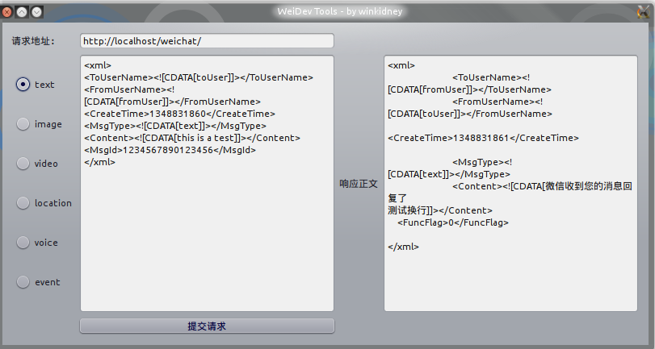

wei-dev
=======

一个微信图形界面调试工具，免去你将程序部署到服务器的麻烦。

###它做什么？
* 可以在本地调试你的微信服务程序。微信服务调试原来都是要将程序部署到服务器上的……嗯……我的vps上传文件很慢，所以受不了了，写了这个。
* 消息模板，预置了几种消息模板，你可以选择后随意修改，然后发送到你的测试服务器。
* 支持自定义消息内容，包含openid之类，当然也可以用来测试微信服务器的模拟session之类的功能

###安装使用
+ 安装  
这个程序使用pyqt4构建的,你需要先安装pyqt4
```bash
pip install PyQt4
```
等待完成，然后运行你的weidev.py即可。   
+ 使用
如下图，看到这个你应该什么都明白了:)


###Change Log

- 2014-05-09 first release maybe for last.

###FAQ
+ 为何偶尔会卡住，程序动不了了？    
那是因为urllib2正在打开url,阻塞了程序，由于简单起见并没有使用线程，遇到卡顿请等待一会，会响应的:)

###说明

如果你觉得这个小程序有用，请给我一个赞……（啊？好像没发现哪里有赞啊……嗯嗯……不要在意这些细节
另外第一次用pyqt，代码很丑，欢迎各种更改代码结构和添加功能，pull request你值得拥有：）


###关于

我的[Github](https://github.com/winkidney)
我的[BLOG](http://blog.gg-workshop.com)

